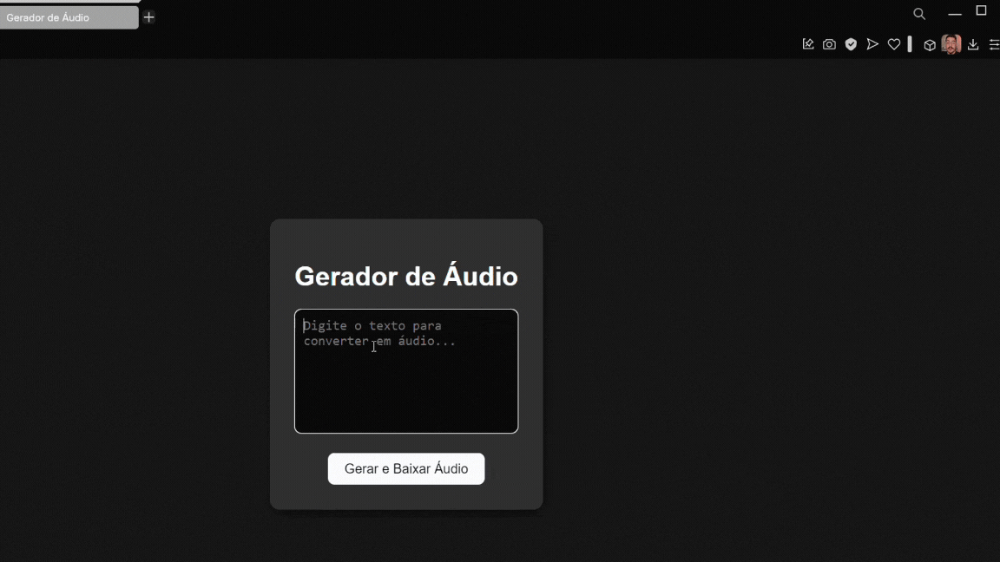

# Gerador de Áudio - Projeto de Conversão de Texto para Fala

Este projeto consiste em uma aplicação web simples que converte texto em áudio utilizando a biblioteca `edge_tts`. O usuário insere um texto na interface web e recebe um arquivo de áudio (MP3) gerado automaticamente com a fala correspondente ao texto inserido. A aplicação utiliza o framework Flask para o backend e HTML/CSS para a interface frontend.



## Tecnologias Utilizadas

- **Flask**: Framework web utilizado para criar a aplicação backend.
- **edge_tts**: Biblioteca para gerar a fala a partir de texto, utilizando a tecnologia de síntese de fala da Microsoft.
- **HTML/CSS**: Para criar a interface do usuário simples e funcional.
- **Python 3.x**: Linguagem de programação utilizada para o desenvolvimento da aplicação.

## Funcionalidade

A aplicação oferece as seguintes funcionalidades:

1. **Entrada de Texto**: O usuário pode inserir um texto na interface web.
2. **Geração de Áudio**: Após enviar o texto, a aplicação gera um arquivo de áudio MP3 usando o `edge_tts`, que transforma o texto inserido em fala.
3. **Download do Áudio**: O usuário pode baixar o arquivo de áudio gerado diretamente para o seu dispositivo.

## Como Funciona

1. **Interface Web**: A página principal possui um campo de texto (`textarea`) onde o usuário pode digitar ou colar o texto que deseja converter em áudio.
2. **Geração do Áudio**: Quando o usuário clica no botão "Gerar e Baixar Áudio", o texto é enviado via método POST para o servidor Flask.
3. **Processamento Assíncrono**: O servidor, utilizando a biblioteca `edge_tts`, gera o arquivo de áudio em formato MP3 de forma assíncrona.
4. **Download**: Após a geração do áudio, o arquivo MP3 é retornado para o navegador do usuário, que pode realizar o download.

## Instalação

Para rodar o projeto localmente, siga os passos abaixo:
### 1. Clone o repositório

```bash
git clone https://github.com/seu-usuario/gerador-de-audio.git
cd gerador-de-audio
```
### 2. Instale as dependências
Certifique-se de ter o Python 3.x instalado. Se não tiver, você pode instalar o Python aqui.
Crie e ative um ambiente virtual (opcional, mas recomendado):
```bash
python -m venv venv
source venv/bin/activate  
```
Instale as dependências necessárias:
```bash
pip install -r requirements.txt
```
O arquivo requirements.txt deve conter as bibliotecas:
```bash
Flask
edge-tts
```
### 3. Execute a aplicação
Após instalar as dependências, execute o seguinte comando para rodar o servidor Flask:
```bash
python app.py
```
O servidor estará disponível em http://127.0.0.1:5000/. Abra o navegador e acesse essa URL para testar a aplicação.

### 4. Estrutura do Projeto
O projeto tem a seguinte estrutura de diretórios:
```bash
/gerador-de-audio
│
├── app.py                  # Arquivo principal do servidor Flask
├── requirements.txt        # Arquivo com as dependências do projeto
├── templates/
│   └── index.html          # Arquivo HTML da interface
└── static/
    └── styles.css          # Arquivo CSS para estilização da interface
```
app.py: Contém a lógica do backend, incluindo a configuração do Flask e as rotas para gerar o áudio.
templates/index.html: Arquivo HTML que renderiza a interface do usuário.
static/styles.css: Arquivo CSS para o design da interface web.

### 5. Como Contribuir
Se você deseja contribuir para o projeto, siga os passos abaixo:

* Faça um fork deste repositório.
* Crie uma branch para sua feature ou correção (git checkout -b minha-feature).
* Faça as alterações e commit (git commit -am 'Adicionando nova feature').
* Envie para a branch principal (git push origin minha-feature).
* Abra um pull request.